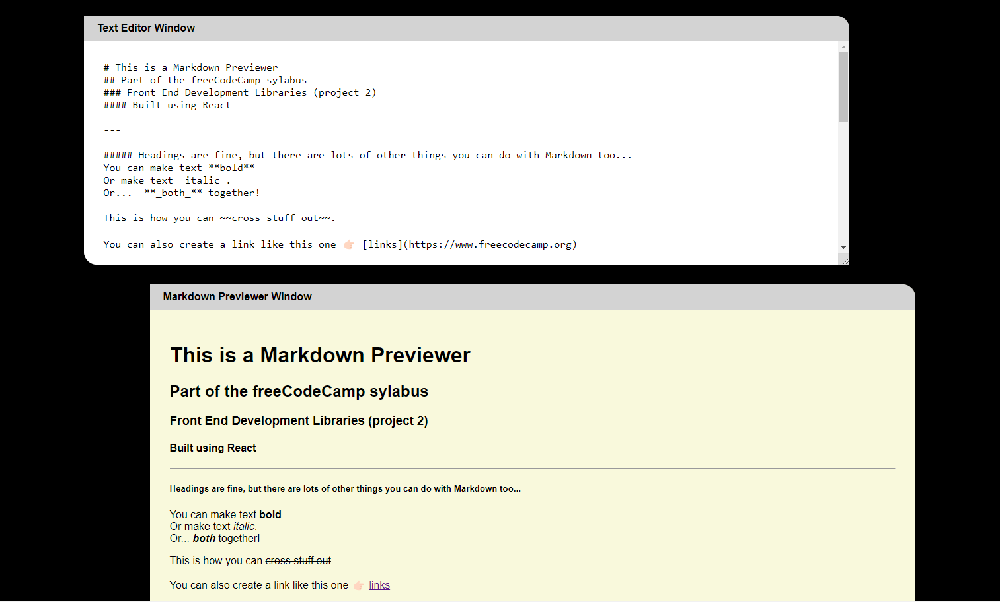

# Markdown Previewer

Table of content

  
## Table of Content
- [Summary](#summary)
- [Technologies](#technologies)
- [Instructions](#instructions)
- [Updates](#updates)
- [Live Site](#live-site)  
- [Status](#status)
- [License](#license)

## Summary

Preview Markdown output in real time as you type 
A project built as part of the **Front End Development Libraries** course by **freeCodeCamp**

## Technologies

 

This project is built with **React** using [Create React App](https://github.com/facebook/create-react-app) and uses the [marked](https://github.com/markedjs/marked) npm package.

---

---

## Instructions

- Type your Markdown code in the top (editor) window and see it rendered as you type in the bottom (previewer) window.
- The editor window can be expanded as needed by dragging the the botton RH corner
- This previewer accepts [GitHub Flavoured Markdown](https://github.github.com/gfm/)

## Updates

### Ideas:
- Add an 'expand' button to the toolbar to maximise one of the windows
- Add improved styles for the rendered markdown esp. block quote and code blocks/snippets

## Live Site

This project is [deployed on Netlify](https://md-pvwr.netlify.app/)

## Status

## License

This project is licensed under the terms of the BSD 3-clause "New" or "Revised" license.

 
